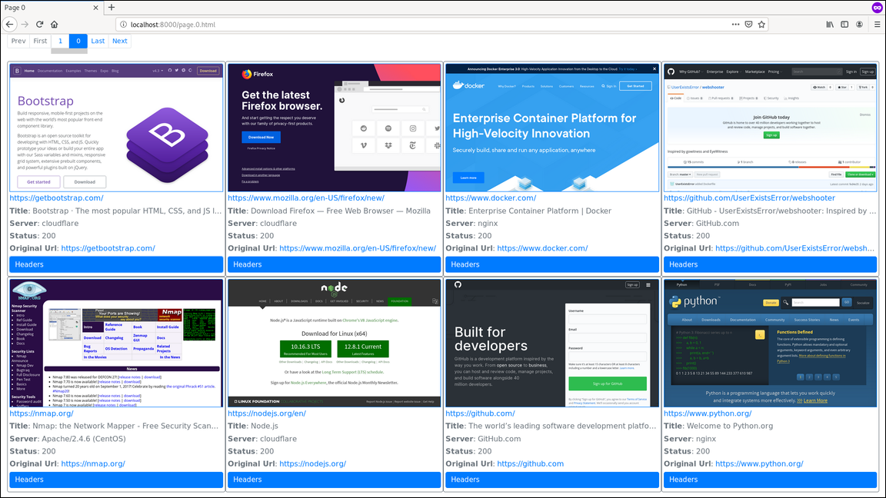

# webshooter

Take screenshots of web sites and generate an HTML report. This tool waits a specified period to allow the page to render before taking the screenshot. Report sorts screenshots by page title and server header.



## Installation

### pip

You can install with `pip` after cloning the repository:

```
pip install .
```

This will check for a nodejs install and install binaries from https://nodejs.org/ if needed. Nodejs and all dependencies will
be installed in the `site-packages` directory, and will be removed when you uninstall webshooter.

### Manual Install

Requires python3.9+, nodejs, and npm. Puppeteer is used for rendering pages and taking screenshots. Jinja2 is used for html and JavaScript templating.

Get the latest Node LTS from here https://nodejs.org/ and extract it. Add the bin directory (contains node and npm) to your PATH. Testing has been done
with Node 16.x.

Install remaining requirements:

```
npm install
pip3 install -r requirements.txt
```

`npm install` will create a `node_modules/` directory with its dependencies. Webshooter needs to be able to find this directory when it runs. You
can run webshooter in the same directory you ran `npm install` from (or a subdirectory), or you can specify `NODE_PATH=/path/to/node_modules` when running.

### Docker

Instead of manually installing dependencies, you can just build from the included Dockerfile with:

```
docker build -t webshooter .
```

Then run with:

```
docker run -it -p 127.0.0.1:8000:8000/tcp webshooter
```

After generating a report, you can access it outside the container with:

```
python -m http.server 8000
```

Browse to http://localhost:8000/page.0.html from your host to access the report.

## Usage

```
webshooter.py --session myscreens scan [-u URL_FILE] [-x NMAP_XML] [URL [... URL]]
```
This will grab screenshots of all supplied urls. The session file can be used to resume a scan and generate a report. This command can be run multiple times with new urls to add. Once a url is added, it will be remembered in the session file. A screenshot will be attempted once for each url. Failed screenshots can be reattempted with `--retry`.

You can also provide a file with 1 url per line and pass it in with `-u`. Positional arguments are also treated as urls. In addition to urls, you can specify HOST[:PORT]. If the port is not specified in the url, it is inferred from the scheme. If no scheme or port is given, http/80 and https/443 are both attempted.

An nmap xml file can also be used with `-x`. Open ports that are considered HTTP (80,8080) or HTTPS (443,8443) will be scanned. You can override these ports with `--ports-http` and `--ports-https`. `--all-open` will treat all open ports as http/s and overrides `--ports-http` and `--ports-https`. Note that `--ports-http[s]` only applies to nmap xml.

Recommended usage is to provide an nmap xml file generated like so:
```
nmap -p 80,443,8000,8080,8443,8888 -oX http.xml ...
```
Additional HTTP ports can be added.

## Report

```
webshooter.py --session myscreens report
```
The default report generates a tile view which doesn't require vertical scrolling. Use `--column` to get a less dense report with 1 screenshot per row. Screens per page can be set with the `-p` option. Navigate pages using the navigation bar or by using the left and right arrow keys. Screenshots are sorted by page title (or Server header if no title). The file `index.html` is generated with the report that links to the first instance of each unique page title.
